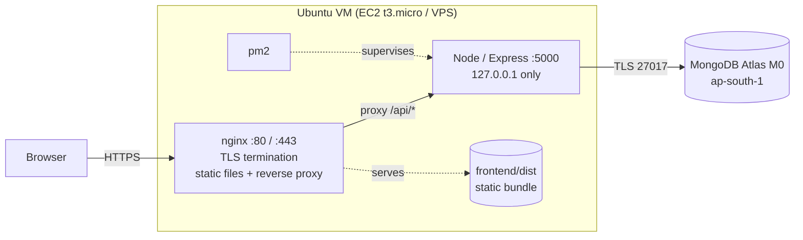
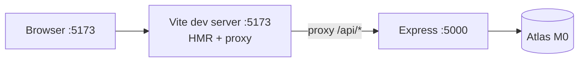
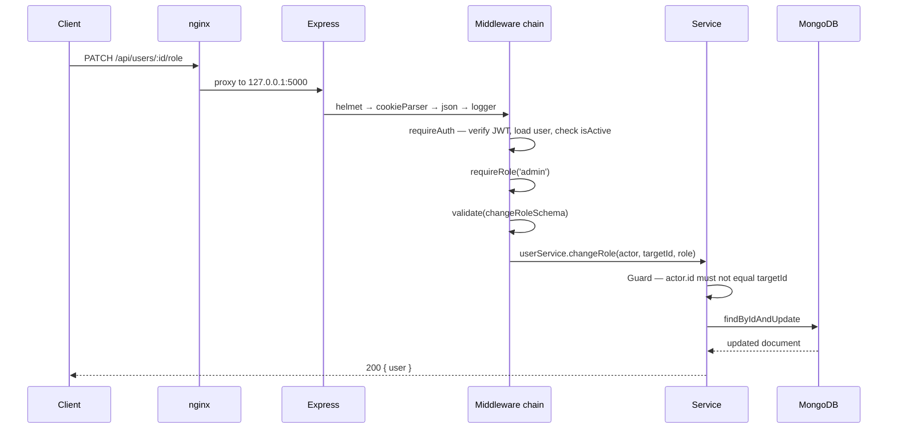
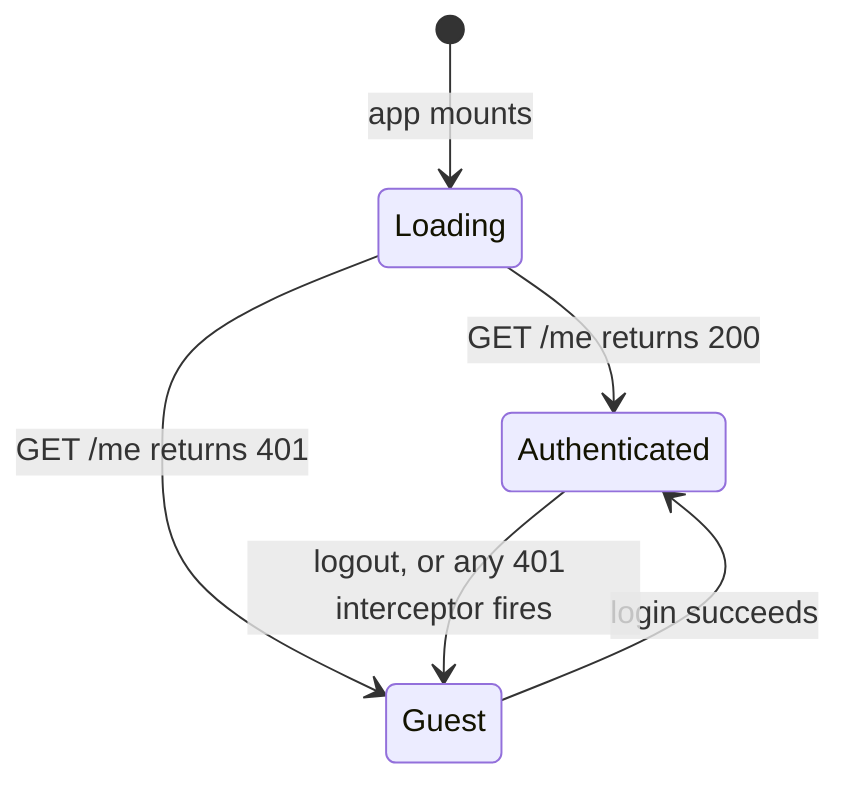
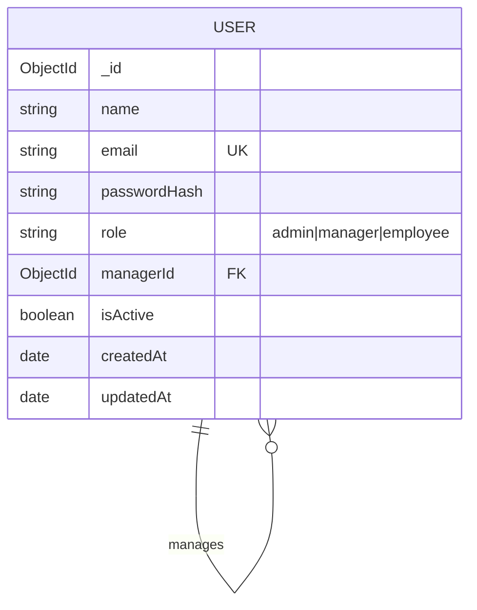

# Architecture — Deploylab

| Field | Value |
|---|---|
| Version | 1.0 |
| Date | 2026-09-08 |

---

## 1. Guiding Decisions

Four decisions shape everything else in this document.

**Same-origin in production.** nginx serves the built React bundle and proxies `/api/*` to Node on `localhost:5000`. The browser sees one origin, so there is no CORS preflight, no `sameSite=none`, and no cookie-domain puzzle. This is the single most consequential choice in the project — it removes an entire category of "works locally, breaks in production" bugs.

**Monorepo.** One repository, one `git pull`, one deploy script. Two repositories would double the CI configuration for no learning benefit at this scale.

**JWT in an httpOnly cookie.** Tokens in `localStorage` are readable by any injected script. An httpOnly cookie is not, and it is sent automatically, so the client needs no token-handling code at all.

**Managed database.** Atlas M0 removes database operations from the critical path. The point of this project is to learn application deployment; running `mongod` yourself is a separate lesson, deliberately deferred to Phase 13.

---

## 2. Production Topology



**Request paths**

| Request | Route |
|---|---|
| `GET /` | nginx → `frontend/dist/index.html` |
| `GET /assets/index-abc123.js` | nginx → `frontend/dist/assets/…`, cached one year (hashed filename) |
| `GET /profile` | nginx → `index.html` — SPA fallback, React Router takes over |
| `POST /api/auth/login` | nginx → `http://127.0.0.1:5000/api/auth/login` |

The SPA fallback (`try_files $uri $uri/ /index.html`) is the classic first-deployment bug: without it, the home page works but refreshing any other route returns 404 from nginx, because no file named `profile` exists on disk.

Express binds to `127.0.0.1`, not `0.0.0.0`. Port 5000 is then unreachable from the internet regardless of firewall configuration — defence in depth, since nginx is the only intended entry point.

---

## 3. Development Topology



Vite's dev-server proxy forwards `/api` to Express, so the browser still sees a single origin in development. Development and production therefore behave identically with respect to cookies and CORS — the environment gap that causes most first-deployment surprises simply does not exist here.

| Aspect | Development | Production |
|---|---|---|
| Frontend | Vite dev server, port 5173 | Static files served by nginx |
| Same-origin mechanism | Vite proxy | nginx `location /api` |
| Cookie `secure` flag | `false` (plain HTTP) | `true` (HTTPS only) |
| Process supervision | `nodemon` | `pm2` |
| Source maps | Full | Disabled |
| Error responses | Include stack traces | Message only |

---

## 4. Backend Structure

```
backend/
├── src/
│   ├── config/
│   │   ├── env.js            Validates and exports environment variables
│   │   ├── cookie.js         Session cookie name and attributes
│   │   └── db.js             Mongoose connection with retry
│   ├── models/
│   │   └── User.js
│   ├── middleware/
│   │   ├── requireAuth.js    Verifies the JWT cookie, loads the user
│   │   ├── requireRole.js    Role gate factory
│   │   ├── validate.js       Zod schema validation
│   │   ├── rateLimiter.js
│   │   └── errorHandler.js   Terminal error middleware
│   ├── controllers/
│   │   ├── health.controller.js
│   │   ├── auth.controller.js
│   │   └── user.controller.js
│   ├── services/
│   │   ├── auth.service.js
│   │   └── user.service.js
│   ├── routes/
│   │   ├── auth.routes.js
│   │   ├── user.routes.js
│   │   └── index.js
│   ├── validators/
│   │   ├── auth.schema.js
│   │   └── user.schema.js
│   ├── utils/
│   │   ├── ApiError.js
│   │   └── serializeUser.js  The one shape a user leaves the API in
│   ├── app.js               Express app: middleware and routes, no listening
│   └── server.js            Connects to the DB, listens, handles signals
├── scripts/
│   └── seed.js
├── .env.example
└── package.json
```

`app.js` and `server.js` are separate so the Express app can be imported and exercised without opening a port — the standard arrangement for testability, and it costs nothing to adopt from the start.

### Layer responsibilities

| Layer | Does | Does not |
|---|---|---|
| Route | Maps a path to middleware and a controller | Contain logic |
| Middleware | Cross-cutting concerns: auth, validation, rate limiting | Know about specific features |
| Controller | Reads the request, calls a service, shapes the response | Touch the database |
| Service | Business rules and database access | Know about HTTP |
| Model | Schema, indexes, hooks | Contain business rules |

The controller/service split is what keeps rules like "an admin cannot demote themselves" in one place rather than scattered across route handlers.

### Request lifecycle



Any thrown `ApiError` short-circuits to `errorHandler`, which is the only place in the codebase that formats an error response.

Express 5 forwards rejected promises from async handlers to error middleware on its own, so no `asyncHandler` wrapper is needed. That wrapper is an Express 4 pattern still copied into most tutorials — worth knowing it is now obsolete.

---

## 5. Frontend Structure

```
frontend/
├── src/
│   ├── api/
│   │   ├── client.js          Axios instance, withCredentials, 401 interceptor
│   │   ├── auth.api.js
│   │   └── users.api.js
│   ├── context/
│   │   └── AuthContext.jsx    user, loading, login, register, logout, refresh
│   ├── components/
│   │   ├── layout/            AppShell, Header, Nav
│   │   ├── routing/           ProtectedRoute, GuestRoute, RoleRoute
│   │   └── ui/                Button, Input, Badge, Spinner, Toast, Modal, Table
│   ├── pages/
│   │   ├── Login.jsx
│   │   ├── Register.jsx
│   │   ├── Dashboard.jsx
│   │   ├── Profile.jsx
│   │   ├── AdminUsers.jsx
│   │   ├── Team.jsx
│   │   └── NotFound.jsx
│   ├── hooks/
│   │   └── useAuth.js
│   ├── App.jsx                Route table
│   └── main.jsx
├── .env.example
├── vite.config.js
└── package.json
```

### Auth context lifecycle



The `Loading` state exists to prevent a flash of the login screen on refresh. Route rendering is blocked until the initial `/me` call resolves.

### The 401 interceptor

A single Axios response interceptor catches any `401`, clears auth state, and redirects to `/login`. Centralising it means no individual API call has to handle session expiry. The one exception is the `/me` call itself during startup, which is expected to `401` for guests and must not trigger a redirect loop.

---

## 6. Data Model

Only one collection. Everything RBAC needs fits in it.

### `users`

| Field | Type | Constraints | Notes |
|---|---|---|---|
| `_id` | ObjectId | Primary key | |
| `name` | String | Required, 2–60, trimmed | |
| `email` | String | Required, unique, lowercase, indexed | Login identifier |
| `passwordHash` | String | Required, `select: false` | bcrypt, cost 12 |
| `role` | String | Enum `admin` / `manager` / `employee`, default `employee` | |
| `managerId` | ObjectId → users | Nullable, indexed | Null for admins and unassigned users |
| `isActive` | Boolean | Default `true` | False blocks login and invalidates live sessions |
| `createdAt` | Date | Auto | |
| `updatedAt` | Date | Auto | |

`select: false` on `passwordHash` means every query omits it unless explicitly requested. Requirement NFR-08 — never leak the hash — becomes the default rather than something to remember at each call site.

### Password handling

The schema exposes a write-only `password` virtual. Assigning to it stashes the plaintext on the document; a `pre('validate')` hook replaces it with a bcrypt hash. There is no getter, so plaintext can never be read back off a document.

Hashing runs on `validate` rather than `save` because Mongoose validates before save hooks fire. A `pre('save')` hook would run *after* `passwordHash` had already been checked as required, which would force the field to be populated with plaintext first purely to pass validation. Hashing during validation means the plaintext never occupies the field at all.

`comparePassword` requires the document to have been loaded with `.select('+passwordHash')`. It returns `false` rather than throwing when the hash is absent, so a caller who forgets the select gets a failed login instead of a 500.

### Indexes

| Index | Purpose |
|---|---|
| `{ email: 1 }` unique | Login lookup, uniqueness enforcement |
| `{ managerId: 1 }` | Manager's team query |
| `{ role: 1 }` | Admin role filter |

### Relationships



Self-referencing: a manager is simply a user whom other users point at through `managerId`.

---

## 7. Authentication Flow

```mermaid
sequenceDiagram
    participant B as Browser
    participant A as API
    participant D as MongoDB

    Note over B,D: Login
    B->>A: POST /api/auth/login { email, password }
    A->>D: findOne({ email }).select('+passwordHash')
    D-->>A: user document
    A->>A: bcrypt.compare
    A->>A: reject if isActive is false
    A->>A: sign JWT { sub: user._id, role }
    A-->>B: 200 + Set-Cookie: token=… HttpOnly; SameSite=Lax; Secure

    Note over B,D: Any protected request
    B->>A: GET /api/users (cookie sent automatically)
    A->>A: jwt.verify
    A->>D: findById(sub)
    D-->>A: user
    A->>A: reject if missing or inactive
    A->>A: requireRole('admin')
    A-->>B: 200 { users }
```

### Token design

| Property | Value | Reasoning |
|---|---|---|
| Algorithm | HS256 | Symmetric is sufficient — one service signs and verifies |
| Payload | `{ sub, role, iat, exp }` | Minimal; a JWT payload is signed but not encrypted, so it holds nothing private |
| Lifetime | 24 hours, configurable | Long enough to avoid nuisance re-logins, short enough to bound a leaked token |
| Storage | httpOnly cookie | Unreadable by JavaScript |
| Refresh | None in v1.0 | Refresh-token rotation is real complexity; deliberately deferred |

### Why the database is read on every request

The JWT alone would be enough to identify the user, and skipping the lookup would be faster. The lookup is kept anyway so that deactivation takes effect immediately (BR-04) and so a role change applies on the user's next request rather than up to 24 hours later. At this scale the cost is an indexed `findById` — negligible, and the correctness gain is large.

### Cookie attributes

| Attribute | Development | Production | Purpose |
|---|---|---|---|
| `httpOnly` | true | true | Blocks JavaScript access |
| `secure` | false | true by default | HTTPS only — overridable via `COOKIE_SECURE`, see below |
| `sameSite` | lax | lax | CSRF mitigation while keeping normal navigation working |
| `maxAge` | 24h | 24h | Matches token expiry |
| `path` | `/` | `/` | Sent with every request |

`sameSite=lax` plus same-origin deployment means no separate CSRF token is required for this threat model. A cross-site `POST` will not carry the cookie.

### Why `secure` is its own setting

It would be tidier to derive `secure` from `NODE_ENV`, and that was the original design. It breaks on a production deployment without TLS: a browser silently discards a `Secure` cookie delivered over plain HTTP, so login returns `200`, the client sets its user state from the response body, and the failure only surfaces on the *next* authenticated request as a confusing "session expired".

`COOKIE_SECURE` therefore overrides, defaulting to `NODE_ENV` when unset. It is validated as an explicit `'true' | 'false'` enum rather than a boolean coercion, because `z.coerce.boolean()` treats every non-empty string as true — `COOKIE_SECURE=false` would mean the opposite of what it says.

Turning it off is a real cost, not a formality: the session token then crosses the network in plaintext, and anyone on the path can copy it and impersonate that user for the life of the token. It exists so an IP-only deployment can work while TLS is still pending, and nothing more.

---

## 8. Configuration

### Backend (`backend/.env`)

| Variable | Example | Notes |
|---|---|---|
| `NODE_ENV` | `development` \| `production` | Drives cookie `secure` and error verbosity |
| `PORT` | `5000` | |
| `MONGODB_URI` | `mongodb+srv://…` | Atlas connection string |
| `JWT_SECRET` | 64 random hex characters | Generate with `openssl rand -hex 32` |
| `JWT_EXPIRES_IN` | `24h` | |
| `CLIENT_ORIGIN` | `http://localhost:5173` | Development CORS only; unused in production |
| `SEED_ADMIN_EMAIL` | `admin@deploylab.local` | Used by the seed script |
| `SEED_ADMIN_PASSWORD` | | Used by the seed script |

`config/env.js` validates these at startup and exits with a clear message if any is missing. Failing fast at boot beats a `jwt malformed` error appearing during the first login attempt on a fresh server.

### Frontend (`frontend/.env`)

| Variable | Development | Production |
|---|---|---|
| `VITE_API_URL` | `/api` | `/api` |

Same value in both, because both are same-origin. It exists as a variable purely to document the assumption. Note that Vite inlines `VITE_*` values at **build** time, not run time — changing one requires a rebuild, which is itself a useful thing to internalise before the CI/CD phase.

---

## 9. Error Handling

### Response shape

Every error returns the same JSON shape, so the client needs exactly one parser:

```json
{ "success": false, "message": "Human readable message", "code": "FORBIDDEN" }
```

In development only, a `stack` field is appended.

### Status code usage

| Code | Used when |
|---|---|
| 400 | Validation failure, or a business rule violated |
| 401 | Missing, invalid, or expired token |
| 403 | Authenticated but the role is insufficient, or the account is deactivated |
| 404 | Resource does not exist |
| 409 | Uniqueness conflict — a duplicate email |
| 429 | Rate limit exceeded |
| 500 | Unhandled server fault |
| 503 | Health check failing — the database is unreachable |

---

## 10. Operational Concerns

### Health endpoint

`GET /api/health` returns `200` with `{ status, db, uptime, timestamp }` when Mongoose reports a connected state, and `503` otherwise. This is what a load balancer, uptime monitor, or post-deploy smoke test polls.

### Graceful shutdown

On `SIGTERM` or `SIGINT`: stop accepting new connections, wait for in-flight requests to finish, close the Mongoose connection, exit `0`. A hard 10-second timeout forces exit if something hangs. Without this, every `pm2 reload` drops requests that were mid-flight.

### Database connection resilience

The initial connection retries with exponential backoff rather than exiting on first failure. On a rebooting server, the application often starts before the network is fully up; exiting immediately would leave pm2 restart-looping against a transient condition.

### Logging

`morgan` in `combined` format to stdout. pm2 captures stdout and stderr to `~/.pm2/logs/`. Log rotation is configured via `pm2-logrotate` — a 1 GB free-tier disk fills faster than expected.

---

## 11. Security Summary

| Control | Mechanism |
|---|---|
| Password storage | bcrypt, cost 12 |
| Token theft via XSS | httpOnly cookie |
| CSRF | `sameSite=lax` plus same-origin deployment |
| Brute force | `express-rate-limit` on auth routes |
| Response headers | Helmet |
| Injection | Mongoose casting plus Zod validation |
| Account enumeration | Identical error text for unknown email and wrong password |
| Privilege escalation | Server-side role checks; self-role-change blocked |
| Secret exposure | `.env` gitignored; CI secrets held in GitHub Actions |
| Transport | TLS via Let's Encrypt; HTTP redirected to HTTPS |
| Network exposure | Express bound to `127.0.0.1`; only ports 22, 80, 443 open |

---

## 12. Deliberate Trade-offs

| Decision | Cost | Why it is acceptable here |
|---|---|---|
| No refresh tokens | A user re-authenticates daily | Meaningful complexity for a learning project; the 24-hour window is an acceptable exposure |
| Database read per request | One indexed lookup per call | Buys immediate deactivation and role changes |
| Single collection | No separate roles table | Three fixed roles do not justify a join |
| Single instance | No horizontal scaling | pm2 cluster mode is a later exercise if wanted |
| No test suite in v1.0 | Manual verification only | Deployment is the learning objective; tests are the first addition afterwards |
| Atlas over self-hosted | External dependency, network latency | Keeps database operations off the critical path until Phase 13 |
